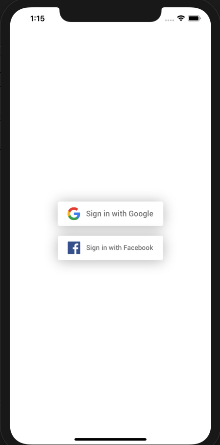

# React native with google login, facebook login and update logged-in user's information in firebase's realtime database  

- Learn how to add Expo(Version 36.0.0) Google & Facebook Login to your app and save it to your Firebase Realtime Database 




### Reference:
* [React Native Firebase Tutorials #1](https://www.youtube.com/watch?v=ZcaQJoXY-3Q&list=PLy9JCsy2u97nVN5GxrjC6rv9XfyxoDtB_)
* [React Native Firebase Tutorials #2](https://www.youtube.com/watch?v=GZKaVJEd4JU&list=PLy9JCsy2u97nVN5GxrjC6rv9XfyxoDtB_&index=2)
* https://docs.expo.io/versions/v36.0.0/sdk/google/
* https://reactnavigation.org/docs/react-native-screens/
* https://blog.expo.io/react-native-google-sign-in-with-expo-d1707579a7ce
* https://docs.expo.io/versions/latest/sdk/facebook/
* https://hackernoon.com/firebase-auth-using-facebook-log-in-on-expo-react-native-2c9f1aaf26b7

### Install Dependencies

* expo init your-project-name
* cd your-project-name
* npm install --save react-navigation
* expo install react-native-gesture-handler
* npm install expo-google-app-auth
* npm install --save firebase
* expo install react-native-screens
* expo install expo-facebook
* npm install
* expo start


### Configure config.js 
```sh
export const firebaseConfig = {
  apiKey: '',
  authDomain: '',
  databaseURL: '',
  projectId: '',
  storageBucket: ''
};
```

### Package name must be 'host.exp.exponent' if runs in local!!